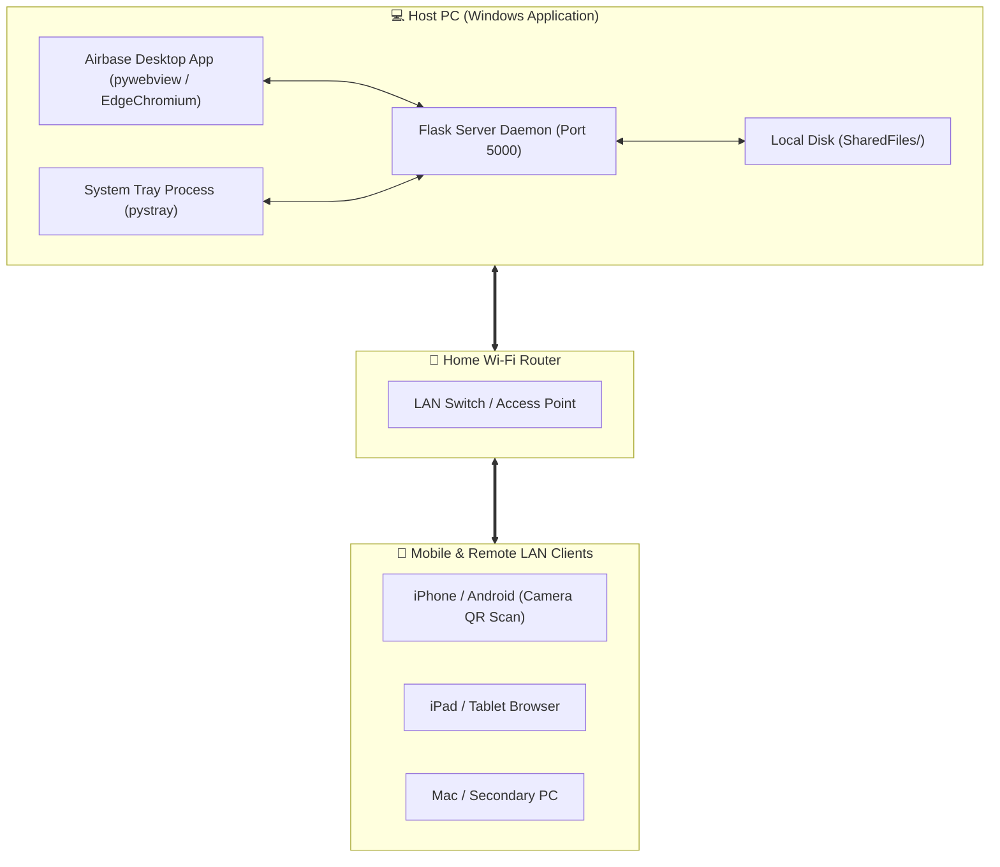

# 🌐 Airbase — Home LAN File Sharing Hub

[](https://opensource.org/licenses/MIT)
[](#)
[](#)
[](#)
[](#)

> **Airbase** is a zero-configuration, cross-platform local network file sharing hub. Share files, folders, videos, photos, and clipboard text instantly across iPhones, Androids, Macs, and PCs on your Wi-Fi network — without cloud uploads, account creation, or cables.

---

## 🎯 System Architecture



---

## ✨ Key Features

- 📱 **QR Code Instant Connect:** Scan with any phone camera to open the network hub in seconds.
- ⚡ **Zero-Dependency Executable:** Single standalone Windows binary (`Airbase.exe`) with embedded Python & web runtime.
- 🖥️ **Native Desktop Window & Tray Icon:** Native desktop app window (`pywebview`) paired with a silent background system tray daemon.
- 📌 **Auto-Desktop Icon Creation:** Automatically pins an Airbase shortcut with custom branding to the user's Desktop on launch.
- 📂 **Nested Folder Management:** Create subfolders, upload entire directory structures, navigate with breadcrumbs, and download file selections as a `.zip`.
- 📋 **Global Clipboard Sync:** Press `Ctrl+V` anywhere in the app to paste copied images or text snippets straight to the network hub.
- 🎬 **In-App Media Streamer & Lightbox:** Stream video/audio, view full-resolution photos, and inspect code/text files directly in browser lightboxes without downloading.
- 🔒 **100% Private & Local:** All data flows peer-to-peer over your local network. Zero external cloud servers, zero telemetry.
- 🎨 **Glassmorphism 2.0 UI:** Dark/Light theme toggle, fluid CSS animations, audio feedback, and touch-optimized mobile layout.

---

## 🚀 Quick Start for Users (No Setup Required)

1. Download **`Airbase-v1.0-Windows.zip`** from [Releases](https://github.com/SakethGoljana/Airbase/releases).
2. Extract the folder and double-click **`Airbase.exe`**.
3. Point any phone camera at the QR code shown on screen to connect instantly over Wi-Fi!

---

## 💻 Developer Setup & Running from Source

If you want to contribute or build from source:

```bash
# 1. Clone the repository
git clone https://github.com/SakethGoljana/Airbase.git
cd Airbase

# 2. Run the automated start script (creates .venv & installs dependencies)
start.bat
```

Or manually:

```bash
python -m venv .venv
.venv\Scripts\activate
pip install -r requirements.txt
python share_server_gui.py
```

---

## 🔌 API Endpoint Reference

| Method | Endpoint | Description |
| :--- | :--- | :--- |
| `GET` | `/` | Serves main Glassmorphism web application interface |
| `GET` | `/api/files` | Returns JSON listing of all files and folders in current directory |
| `POST` | `/api/upload` | Handles single or multi-file multipart uploads (support for nested subpaths) |
| `POST` | `/api/create_folder` | Creates a new folder inside `SharedFiles/` |
| `POST` | `/api/download_zip` | Bundles selected files or folders into a `.zip` archive on the fly |
| `POST` | `/api/delete_batch` | Safely deletes selected files or folders (includes WinError lock handling) |
| `GET/POST` | `/api/quick_text` | Syncs shared clipboard text & Wi-Fi passwords across connected devices |
| `GET` | `/api/analytics` | Returns storage analytics and total disk usage metrics |

---

## 🔒 Security & Path Traversal Protection

Airbase includes strict security controls to ensure files outside `SharedFiles/` cannot be accessed:

- **Path Normalization:** Uses `resolve_secure_path()` to validate that all requested subpaths strictly resolve within the `SharedFiles` root boundary.
- **Path Traversal Shield:** Prevents `../` directory traversal attacks.
- **Local Network Scoping:** Server binds exclusively to LAN interfaces (`0.0.0.0`) and is isolated from external internet routers.

---

## 📦 Building the Standalone Executable & Installer

To build the standalone `.exe` package yourself:

```bash
build_exe.bat
```

This compiles the source code using PyInstaller into `dist/AirbaseApp/Airbase.exe`.

To generate a full Windows Installer wizard (`Airbase-Setup-v1.0.exe`):
1. Install [Inno Setup](https://jrsoftware.org/isdl.php).
2. Right-click `airbase_setup.iss` and click **Compile**.

---

## 📄 Open Source License

Distributed under the **MIT License**. See [`LICENSE`](LICENSE) for full details.
